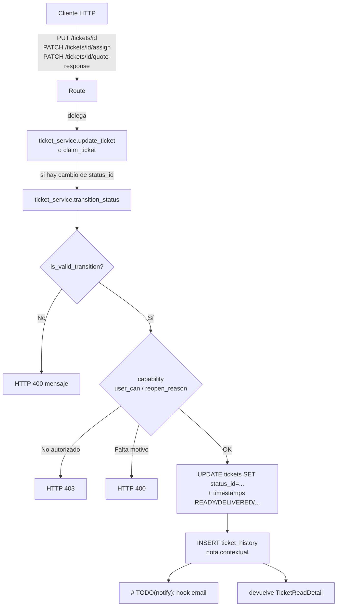
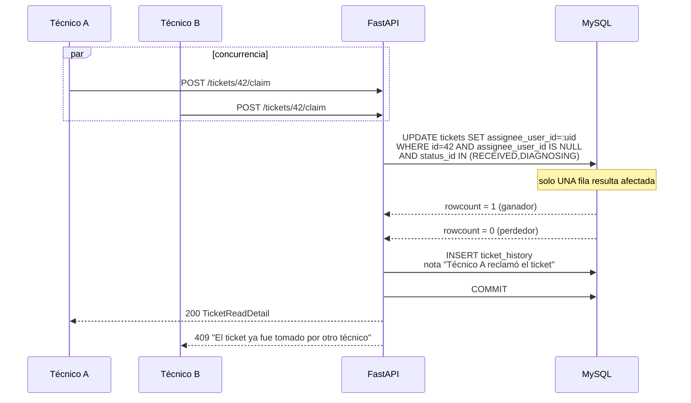
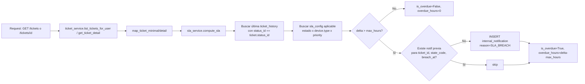

# Design Document — Consolidación del flujo de tickets

> **Spec ID:** `3f8cd893-347c-423f-bbdb-e953154d7b2d`
> **Workflow:** requirements-first
> **Inputs:** `requirements.md` cerrado, decisiones D1–D10 resueltas.

## Overview

Este diseño materializa el spec `tickets-flow-consolidation`. **No introduce un módulo nuevo**: consolida lo que ya existe en `app/services/ticket_service.py`, `app/core/ticket_status_transitions.py` y `app/api/routes/ticket.py`, y agrega tres bloques mínimos:

1. Una sola puerta de entrada para mutar `status_id` (`ticket_service.transition_status`), reutilizada por todos los endpoints que tocan estado.
2. Un endpoint `POST /tickets/{id}/claim` con bloqueo optimista a nivel de `UPDATE`.
3. Una capa de **SLA configurable** (`sla_config`) más detección al vuelo de tickets vencidos y registro en `internal_notification`.

Todo lo que está hoy verde (los 60 tests de `tests/unit/core/test_ticket_status_transitions.py`, las transiciones de `update_ticket`, el flujo de aprobación por cliente) sigue verde. El refactor es interno.

### Principios de diseño

- **Negar por defecto.** Cada endpoint que toca estado debe pasar por una sola función. Ninguna ruta puede setear `status_id` saltándose la validación.
- **Cálculo derivado, no precalculado.** SLA se calcula al serializar. No hay columna materializada `is_overdue`. Si un día es lento, se cachea; en V1 no.
- **Optimismo por default, pesimismo solo si toca.** Para `claim_ticket` y reasignación: lock optimista (`UPDATE … WHERE`). Operaciones multi-tabla pesimistas quedan fuera de este spec, con criterio documentado.
- **Permisos finos via fachada.** `user_can(user, capability)` con fallback hardcodeado por rol; cuando llegue `rbac-fine-grained-permissions`, esa función pasa a consultar tabla sin tocar callers.
- **Aditivo respecto al esquema.** Las migraciones añaden columnas/tablas; ninguna rompe contrato existente.

### Mapa de cambios

| Capa | Archivo | Tipo de cambio |
|---|---|---|
| Migraciones | `alembic/versions/` (3 nuevas) | NUEVO |
| Modelos | `app/models/ticket.py` | columna `priority` |
| Modelos | `app/models/sla_config.py` | NUEVO |
| Modelos | `app/models/internal_notification.py` | NUEVO |
| Core | `app/core/permissions.py` | NUEVO (`user_can`) |
| Core | `app/core/ticket_status_visibility.py` | corrige `ROLE_CLIENT` |
| Core | `app/core/ticket_status_transitions.py` | sin cambios funcionales |
| CRUD | `app/crud/ticket_crud.py` | añade `claim_atomic`, `reassign_atomic`, `get_last_history_for_status` |
| CRUD | `app/crud/sla_config_crud.py` | NUEVO |
| CRUD | `app/crud/internal_notification_crud.py` | NUEVO |
| Service | `app/services/ticket_service.py` | refactor a `transition_status` + `claim_ticket` + filtro 6 meses |
| Service | `app/services/sla_service.py` | NUEVO (`compute_sla`, lazy notify) |
| Service | `app/services/sla_config_service.py` | NUEVO (CRUD admin) |
| Routes | `app/api/routes/ticket.py` | endpoint `claim`; reutilización de `transition_status` |
| Routes | `app/api/routes/sla_config.py` | NUEVO |
| Schemas | `app/schemas/ticket.py` | añade `priority`, `is_overdue`, `overdue_hours`, `acted_on_behalf_of_client`, `reopen_reason` |
| Schemas | `app/schemas/sla_config.py` | NUEVO |
| Tests | `tests/unit/services/`, `tests/integration/`, `tests/property/` | NUEVOS (no se tocan los 60 actuales) |

---

## Architecture

### Diagrama de flujo: transición de estado unificada



### Diagrama de flujo: claim_ticket (lock optimista)



### Diagrama de flujo: cálculo SLA (lazy detection)



### Capas afectadas

```
api/routes/ticket.py            ─┐
api/routes/sla_config.py         │
                                 ▼
services/ticket_service.py    ── transition_status / claim_ticket / list_tickets_for_user
services/sla_service.py       ── compute_sla / record_breach_if_new
services/sla_config_service.py
                                 ▼
crud/ticket_crud.py           ── claim_atomic / reassign_atomic / get_last_history_for_status
crud/sla_config_crud.py
crud/internal_notification_crud.py
                                 ▼
models/ticket.py (priority)   models/sla_config.py   models/internal_notification.py
                                 ▼
core/permissions.py (user_can)
core/ticket_status_visibility.py (CLIENT corregido)
core/ticket_status_transitions.py (sin cambios)
```

---

## Components and Interfaces

### 1. `app/core/permissions.py` (NUEVO)

Fachada centralizada para autorización fina. Hoy hardcodea por rol; cuando aterrice `rbac-fine-grained-permissions`, se reemplaza la implementación sin tocar callers.

```python
# app/core/permissions.py
"""
Fachada de autorización por capability.

Hoy: fallback hardcodeado por rol.
Mañana: consultará tabla `user_permissions` (spec rbac-fine-grained-permissions).
Los callers usan SIEMPRE user_can(user, capability) — nunca leen el rol directo
para decisiones de capability.
"""
from typing import Final

from app.core.roles import ROLE_ADMIN, ROLE_ADVISOR, get_role_name
from app.models.user import User

# Capabilities conocidas — listar como constantes para evitar typos
CAP_TICKETS_APPROVE_QUOTE: Final[str] = "tickets.approve_quote"
CAP_SLA_MANAGE: Final[str] = "sla.manage"
CAP_SLA_READ: Final[str] = "sla.read"


def user_can(user: User, capability: str) -> bool:
    """
    Resuelve si `user` tiene la capability indicada.

    TODO(rbac-fine-grained-permissions): reemplazar por consulta a
    `user_permissions` cuando aterrice ese spec. Mantener la firma.
    """
    role = (get_role_name(user) or "").upper()

    if capability == CAP_TICKETS_APPROVE_QUOTE:
        return role in (ROLE_ADMIN, ROLE_ADVISOR)
    if capability == CAP_SLA_MANAGE:
        return role == ROLE_ADMIN
    if capability == CAP_SLA_READ:
        return role in (ROLE_ADMIN, ROLE_ADVISOR)

    return False  # negar por defecto
```

### 2. `app/services/ticket_service.transition_status` (REFACTOR)

Único punto que muta `status_id`. Todos los endpoints que cambian estado lo invocan.

**Firma:**

```python
def transition_status(
    db: Session,
    ticket: Ticket,
    new_status_code: str,
    user: User,
    *,
    note: Optional[str] = None,
    acted_on_behalf_of_client: bool = False,
    reopen_reason: Optional[str] = None,
) -> Ticket:
    """
    Única vía para cambiar el estado de un ticket.

    Endpoints que la invocan (Requisito 1.2):
    - PUT    /tickets/{id}                     (cuando payload trae status_id)
    - PATCH  /tickets/{id}/assign              (NO cambia estado por sí solo;
                                                la asignación está separada)
    - PATCH  /tickets/{id}/quote-response      (WAITING_APPROVAL → REPAIRING/CANCELLED)
    - POST   /tickets/{id}/claim               (NO cambia estado, solo assignee)

    Reglas:
    1. Llama a is_valid_transition; si False → HTTP 400.
    2. Si el actor no es CLIENT y la transición es WAITING_APPROVAL → REPAIRING/CANCELLED,
       exige user_can(user, "tickets.approve_quote") y formatea la nota como
       "Auto-aprobado/rechazado por {rol} {nombre} en nombre del cliente"
       (Requisito 4.4-bis).
    3. Si la transición es CLOSED→RECEIVED o CANCELLED→RECEIVED, exige
       reopen_reason con len >= 10 → si falta, HTTP 400 (Requisito 6.1).
    4. Actualiza timestamps:
       - READY → ready_at
       - DELIVERED → delivered_at
       - CLOSED, CANCELLED → closed_at
    5. Inserta una fila en ticket_history con nota contextual.
    6. Hook # TODO(notify): dispara notificación al cliente según matriz.
    7. Todo dentro de la misma transacción.
    """
```

**Comportamiento detallado por escenario:**

| Escenario | Validaciones extra | Nota en `ticket_history` |
|---|---|---|
| ADMIN/ADVISOR avanza flujo | `is_valid_transition` | `"Status changed to {Status.name}"` |
| TECHNICIAN avanza flujo | `is_valid_transition` | `"Status changed to {Status.name}"` |
| CLIENT aprueba/rechaza | `is_valid_transition` (rol CLIENT, origen WAITING_APPROVAL) | `"Cliente {full_name} aprobó/rechazó el presupuesto"` |
| ADMIN/ADVISOR aprueba en nombre del cliente | `user_can(user, "tickets.approve_quote")` y `acted_on_behalf_of_client=True` (o auto-inferido si no es CLIENT) | `"Auto-aprobado/rechazado por {rol} {full_name} en nombre del cliente"` |
| ADMIN reabre desde CLOSED/CANCELLED | `reopen_reason` con `len >= 10` | `"Reapertura por {full_name}: {reopen_reason}"` |
| Cualquiera intenta retroceder o saltar | `is_valid_transition` retorna `False` | — (HTTP 400) |

**Refactor de `update_ticket`:**

`update_ticket` deja de manejar `status_id` directo. Cuando detecta cambio de status, hace pop del campo, persiste el resto (`assignee_user_id`, `diagnosis`, …) y delega en `transition_status` para el cambio de estado. La nota proveniente de `history_note` o el campo nuevo `reopen_reason` se pasa como argumento.

```python
def update_ticket(
    self, db: Session, current_user: User, ticket_id: int, data: TicketUpdate
) -> TicketReadDetail:
    db_ticket = ticket_crud.get_by_id(db, ticket_id)
    if not db_ticket or db_ticket.state != 1:
        raise HTTPException(404, "Ticket not found")

    # ... permisos por rol (lo que ya existe, sin cambios) ...

    payload = data.model_dump(exclude_unset=True)
    new_status_id = payload.pop("status_id", None)
    history_note = payload.pop("history_note", None)
    reopen_reason = payload.pop("reopen_reason", None)
    acted_on_behalf = payload.pop("acted_on_behalf_of_client", False)

    # 1. Mutaciones que NO son cambio de estado (assignee, diagnosis, etc.)
    if payload:
        # CONCURRENCY: si payload trae assignee_user_id y el rol es ADMIN/ADVISOR,
        # se invoca reassign_atomic (ver §Concurrencia).
        ticket_crud.update(db, db_ticket, TicketUpdate(**payload))

    # 2. Cambio de estado (si lo hay) delega en transition_status.
    if new_status_id is not None and new_status_id != db_ticket.status_id:
        new_status = ticket_status_crud.get_by_id(db, new_status_id)
        if not new_status:
            raise HTTPException(400, "Invalid status_id")
        self.transition_status(
            db, db_ticket, new_status.code,
            user=current_user,
            note=history_note,
            acted_on_behalf_of_client=acted_on_behalf,
            reopen_reason=reopen_reason,
        )
    else:
        # Si no hubo cambio de estado pero sí history_note, registrar
        # como anotación libre (comportamiento actual).
        if history_note:
            ticket_crud.add_history(db, TicketHistoryCreate(
                ticket_id=db_ticket.id,
                status_id=db_ticket.status_id,
                user_id=current_user.id,
                note=history_note,
            ))
        ticket_crud.commit(db, db_ticket)

    return self.get_ticket_detail(db, db_ticket.id, current_user)
```

### 3. `app/services/ticket_service.claim_ticket` (NUEVO)

```python
def claim_ticket(self, db: Session, ticket_id: int, user: User) -> TicketReadDetail:
    """
    El técnico se asigna a sí mismo un ticket sin asignar.
    Requisitos 2.1, 2.2.

    Concurrencia: lock optimista. Solo el primer UPDATE gana.
    """
    role = get_role_name(user)
    if role != ROLE_TECHNICIAN:
        raise HTTPException(403, "Solo técnicos pueden tomar tickets")

    db_ticket = ticket_crud.get_by_id(db, ticket_id)
    if not db_ticket or db_ticket.state != 1:
        raise HTTPException(404, "Ticket no encontrado")

    current_status = (db_ticket.status.code or "").upper() if db_ticket.status else ""
    if current_status not in {"RECEIVED", "DIAGNOSING"}:
        raise HTTPException(
            400,
            "Solo puedes tomar tickets en estado Recibido o En diagnóstico",
        )

    # TODO(carga-tecnico): aplicar límite por usuario aquí.
    # Cuando se active, validar count(assigned_tickets activos) < tope.

    # CONCURRENCY: optimista — UPDATE … WHERE assignee_user_id IS NULL.
    rowcount = ticket_crud.claim_atomic(db, ticket_id=ticket_id, user_id=user.id)
    if rowcount != 1:
        raise HTTPException(409, "El ticket ya fue tomado por otro técnico")

    # Historia inmediata, dentro de la misma transacción.
    ticket_crud.add_history(db, TicketHistoryCreate(
        ticket_id=ticket_id,
        status_id=db_ticket.status_id,
        user_id=user.id,
        note=f"Técnico {user.full_name or user.email} reclamó el ticket",
    ))
    db.commit()

    return self.get_ticket_detail(db, ticket_id, user)
```

### 4. `app/services/sla_service.py` (NUEVO)

```python
# app/services/sla_service.py
from datetime import datetime
from typing import Tuple

from sqlalchemy.orm import Session

from app.crud.internal_notification_crud import internal_notification_crud
from app.crud.sla_config_crud import sla_config_crud
from app.crud.ticket_crud import ticket_crud
from app.models.ticket import Ticket

TERMINAL_STATES = {"CLOSED", "CANCELLED"}


def compute_sla(db: Session, ticket: Ticket) -> Tuple[bool, int]:
    """
    Retorna (is_overdue, overdue_hours) para el ticket dado.
    Requisitos 3.1, 3.2.

    Algoritmo:
    1. Si el estado es terminal → (False, 0).
    2. Buscar la última entrada de ticket_history con status_id == ticket.status_id.
    3. delta_hours = (utcnow() - history.created_at).total_seconds() / 3600.
    4. Buscar sla_config aplicable (estado, device.type, priority) con fallback.
       Si no hay → (False, 0).
    5. Si delta_hours > max_hours → overdue.
    """
    code = (ticket.status.code or "").upper() if ticket.status else ""
    if code in TERMINAL_STATES:
        return False, 0

    last_h = ticket_crud.get_last_history_for_status(db, ticket.id, ticket.status_id)
    if not last_h or not last_h.created_at:
        return False, 0

    delta_hours = int((datetime.utcnow() - last_h.created_at).total_seconds() // 3600)

    device_type = ticket.device.type if ticket.device else None
    priority = (ticket.priority or "NORMAL").upper()

    cfg = sla_config_crud.find_applicable(
        db, state_code=code, device_type=device_type, priority=priority
    )
    if not cfg:
        return False, 0

    if delta_hours > cfg.max_hours:
        return True, delta_hours - cfg.max_hours
    return False, 0


def record_breach_if_new(db: Session, ticket: Ticket, overdue_hours: int) -> None:
    """
    Requisito 3.3. Lazy detection: cuando compute_sla detecta breach,
    registramos una notificación interna si no existe ya para
    (ticket_id, state_code, breach_window).

    Destinatario por contexto:
    - SLA en DIAGNOSING/REPAIRING con assignee → recipient_user_id = assignee.
    - SLA en DIAGNOSING/REPAIRING sin assignee → recipient_role = 'ADVISOR'.
    - SLA en WAITING_APPROVAL/READY/RECEIVED → recipient_role = 'ADVISOR'.
    """
    code = (ticket.status.code or "").upper()
    # `breach_at` se trunca a la hora de transición al estado actual + max_hours;
    # así, dos llamadas dentro del mismo "evento de breach" no duplican.
    last_h = ticket_crud.get_last_history_for_status(db, ticket.id, ticket.status_id)
    if not last_h:
        return

    cfg = sla_config_crud.find_applicable(
        db, state_code=code, device_type=ticket.device.type if ticket.device else None,
        priority=(ticket.priority or "NORMAL").upper(),
    )
    if not cfg:
        return

    breach_at = last_h.created_at  # punto de entrada al estado; estable
    if internal_notification_crud.exists_breach(
        db, ticket_id=ticket.id, state_code=code, breach_at=breach_at
    ):
        return

    # Resolver destinatario por contexto.
    recipient_user_id: Optional[int] = None
    recipient_role: Optional[str] = None
    if code in {"DIAGNOSING", "REPAIRING"} and ticket.assignee_user_id is not None:
        recipient_user_id = ticket.assignee_user_id
    else:
        recipient_role = "ADVISOR"

    internal_notification_crud.create_sla_breach(
        db,
        ticket_id=ticket.id,
        state_code=code,
        breach_at=breach_at,
        overdue_hours=overdue_hours,
        recipient_user_id=recipient_user_id,
        recipient_role=recipient_role,
    )
```

### 5. `app/services/sla_config_service.py` (NUEVO)

CRUD de administración protegido por `user_can(user, "sla.manage")` (lectura por `sla.read`). Listado, creación, actualización, soft-delete (`is_active=False`). Lógica simple: validaciones de unicidad `(state_code, device_type, priority)` apoyada en el constraint UNIQUE.

### 6. Routes

#### `app/api/routes/ticket.py` (delta)

- Se añade `POST /tickets/{id}/claim` (ver §Endpoints nuevos).
- `PATCH /tickets/{id}/quote-response` deja de armar `TicketUpdate(status_id=...)` y delega directo en `ticket_service.transition_status` con el estado destino y la nota correcta. La validación de propietario se mantiene; el resto se centraliza.
- `PUT /tickets/{id}` se mantiene; internamente `update_ticket` ya delega en `transition_status` cuando ve cambio de status_id.
- `PATCH /tickets/{id}/assign` se mantiene; **no toca estado**. Si se requiere cambiar estado al asignar (p.ej. RECEIVED → DIAGNOSING), debe ser una segunda llamada explícita. Decisión: mantener separación (ver §Decisiones de diseño).

#### `app/api/routes/sla_config.py` (NUEVO)

Router dedicado (`prefix="/tickets/sla-config"`, `tags=["sla"]`). Detalle en §Endpoints nuevos.

### 7. Cambio en `STATUS_VISIBILITY_BY_ROLE[ROLE_CLIENT]`

```python
# app/core/ticket_status_visibility.py — versión nueva
ROLE_CLIENT: {
    "RECEIVED",
    "DIAGNOSING",
    "WAITING_APPROVAL",
    "REPAIRING",
    "READY",
    "DELIVERED",
    "CLOSED",
    "CANCELLED",
},
```

Es solo cambio de constante. La restricción real para CLIENT pasa a ser **propiedad** (`device.owner_user_id == current_user.id`) más el filtro temporal de 6 meses (Req. 5.1).

---

## Data Models

### A. Cambio en `tickets`: campo `priority`

```python
# app/models/ticket.py — añadir
from sqlalchemy import Enum as SAEnum

class Ticket(Base, PKMixin, TimestampStateMixin):
    __tablename__ = "tickets"

    # ... columnas existentes ...

    priority = Column(
        SAEnum("LOW", "NORMAL", "HIGH", "URGENT", name="ticket_priority"),
        nullable=False,
        default="NORMAL",
        server_default="NORMAL",
    )
```

**Política de migración para tickets existentes:** la columna se crea `NOT NULL` con `server_default='NORMAL'`. MySQL aplica el default a todas las filas en el `ADD COLUMN`. No requiere `UPDATE` posterior.

### B. Tabla `sla_config` (NUEVA)

```python
# app/models/sla_config.py
from sqlalchemy import Boolean, Column, Integer, String, UniqueConstraint
from sqlalchemy.dialects.mysql import TINYINT

from app.db.base_class import Base
from app.models.mixins import PKMixin, TimestampStateMixin


class SLAConfig(Base, PKMixin, TimestampStateMixin):
    """
    Configuración administrable de SLA.

    Lookup: (state_code, device_type, priority) → max_hours.
    device_type NULL es legítimo: significa "cualquier tipo de equipo"
    para la combinación (state_code, priority). Se usa como fallback.

    Soft delete vía `is_active`. La columna `state` (de TimestampStateMixin)
    queda como sigue: 1 = visible. El `is_active` específico permite
    desactivar una entrada sin marcarla como eliminada del registro.
    """

    __tablename__ = "sla_config"
    __table_args__ = (
        UniqueConstraint(
            "state_code", "device_type", "priority",
            name="uq_sla_state_device_priority",
        ),
    )

    state_code = Column(String(32), nullable=False, index=True)         # RECEIVED, DIAGNOSING, ...
    device_type = Column(String(20), nullable=True, index=True)         # PHONE, LAPTOP, TABLET, OTHER, NULL
    priority = Column(String(10), nullable=False)                        # LOW | NORMAL | HIGH | URGENT
    max_hours = Column(Integer, nullable=False)
    is_active = Column(TINYINT(1), nullable=False, server_default="1")
```

**Lookup con fallback** (Requisito 3.1.4) — implementado en `sla_config_crud.find_applicable`:

```text
1. (state_code, device_type, priority) exacto y is_active=1
2. (state_code, device_type, "NORMAL")  is_active=1
3. (state_code, NULL,        "NORMAL")  is_active=1
4. None  → ticket nunca vencido por ese estado
```

**Seed inicial** (placeholder, marcado con `# TODO(sla-tuning)`):

```python
# alembic/versions/<rev>_add_sla_config_table.py — fragmento de upgrade()
op.bulk_insert(
    sla_config_table,
    [
        # TODO(sla-tuning): valores placeholder. El admin los ajusta desde panel.
        # DIAGNOSING — phone más rápido que laptop; urgent en mitad del tiempo.
        {"state_code": "DIAGNOSING",      "device_type": "PHONE",  "priority": "NORMAL", "max_hours": 24,  "is_active": 1},
        {"state_code": "DIAGNOSING",      "device_type": "PHONE",  "priority": "URGENT", "max_hours": 8,   "is_active": 1},
        {"state_code": "DIAGNOSING",      "device_type": "LAPTOP", "priority": "NORMAL", "max_hours": 48,  "is_active": 1},
        {"state_code": "DIAGNOSING",      "device_type": "LAPTOP", "priority": "URGENT", "max_hours": 24,  "is_active": 1},
        # WAITING_APPROVAL — depende del cliente, holgura amplia.
        {"state_code": "WAITING_APPROVAL", "device_type": None,    "priority": "NORMAL", "max_hours": 72,  "is_active": 1},
        # REPAIRING — phone más rápido.
        {"state_code": "REPAIRING",       "device_type": "PHONE",  "priority": "NORMAL", "max_hours": 48,  "is_active": 1},
        {"state_code": "REPAIRING",       "device_type": "LAPTOP", "priority": "NORMAL", "max_hours": 96,  "is_active": 1},
        # READY — espera de retiro por cliente, una semana.
        {"state_code": "READY",           "device_type": None,    "priority": "NORMAL", "max_hours": 168, "is_active": 1},
    ],
)
```

### C. Tabla `internal_notification` (NUEVA)

Solo registro. Consumo (UI, email, push) queda fuera de este spec.

```python
# app/models/internal_notification.py
from sqlalchemy import Column, DateTime, ForeignKey, Integer, String, UniqueConstraint
from sqlalchemy.dialects.mysql import JSON

from app.db.base_class import Base
from app.models.mixins import PKMixin, TimestampStateMixin


class InternalNotification(Base, PKMixin, TimestampStateMixin):
    """
    Registro de notificaciones internas (ADMIN/ADVISOR).
    Eventos hoy: SLA_BREACH. Otros vendrán en specs posteriores.
    """

    __tablename__ = "internal_notification"
    __table_args__ = (
        # Una notificación por (ticket, estado, momento de breach).
        UniqueConstraint(
            "entity_type", "entity_id", "reason", "breach_at",
            name="uq_notif_entity_reason_breach",
        ),
    )

    recipient_role = Column(String(32), nullable=True, index=True)         # "ADMIN", "ADVISOR" o NULL (broadcast)
    recipient_user_id = Column(
        Integer,
        ForeignKey("users.id", onupdate="CASCADE", ondelete="SET NULL"),
        nullable=True, index=True,
    )
    reason = Column(String(32), nullable=False, index=True)                # SLA_BREACH | ...
    entity_type = Column(String(32), nullable=False, index=True)           # "ticket"
    entity_id = Column(Integer, nullable=False, index=True)                # ticket.id
    breach_at = Column(DateTime, nullable=True, index=True)                # cuando aplica (SLA_BREACH)
    payload = Column(JSON, nullable=True)                                  # { "overdue_hours": 12, "state_code": "REPAIRING", ... }
    read_at = Column(DateTime, nullable=True)
```

> **Decisión de diseño:** la unicidad usa `breach_at` (timestamp de entrada al estado) + `reason` + `entity`. Así, si el ticket transita y vuelve al mismo estado más adelante, es un nuevo breach con distinto `breach_at` y se registra de nuevo.

### D. Schemas Pydantic (delta)

```python
# app/schemas/ticket.py — delta

class TicketUpdate(BaseSchema):
    # ... campos existentes ...
    priority: Optional[Literal["LOW", "NORMAL", "HIGH", "URGENT"]] = None

    # NUEVO Requisito 4.4-bis
    acted_on_behalf_of_client: bool = False

    # NUEVO Requisito 6.1
    reopen_reason: Optional[Annotated[str, StringConstraints(min_length=10, max_length=500)]] = None


class TicketReadMinimal(TimestampSchema):
    # ... campos existentes ...
    priority: Literal["LOW", "NORMAL", "HIGH", "URGENT"] = "NORMAL"
    is_overdue: bool = False
    overdue_hours: int = 0


class TicketReadDetail(TimestampSchema):
    # ... campos existentes ...
    priority: Literal["LOW", "NORMAL", "HIGH", "URGENT"] = "NORMAL"
    is_overdue: bool = False
    overdue_hours: int = 0
```

```python
# app/schemas/sla_config.py — NUEVO
class SLAConfigBase(BaseSchema):
    state_code: Annotated[str, StringConstraints(min_length=1, max_length=32)]
    device_type: Optional[Annotated[str, StringConstraints(max_length=20)]] = None
    priority: Literal["LOW", "NORMAL", "HIGH", "URGENT"] = "NORMAL"
    max_hours: Annotated[int, Field(ge=1, le=8760)]  # tope: 1 año
    is_active: bool = True


class SLAConfigCreate(SLAConfigBase): ...
class SLAConfigUpdate(BaseSchema):
    state_code: Optional[Annotated[str, StringConstraints(min_length=1, max_length=32)]] = None
    device_type: Optional[Annotated[str, StringConstraints(max_length=20)]] = None
    priority: Optional[Literal["LOW", "NORMAL", "HIGH", "URGENT"]] = None
    max_hours: Optional[Annotated[int, Field(ge=1, le=8760)]] = None
    is_active: Optional[bool] = None


class SLAConfigRead(SLAConfigBase, TimestampSchema):
    id: int
```

---

## Concurrency Strategy

### Tabla operación → estrategia

| Operación | Estrategia | Por qué |
|---|---|---|
| `claim_ticket` | **Optimista** | Una tabla, una columna, dos estados (`NULL → uid`). `UPDATE … WHERE assignee_user_id IS NULL` con verificación `rowcount==1` filtra al ganador sin bloqueos. |
| Reasignación por ADMIN/ADVISOR | **Optimista** con `expected_old_id` | Permite race-detection: si entre lectura y escritura el assignee cambió, el `UPDATE … WHERE assignee_user_id = :expected_old_id` no afecta filas y se devuelve 409. |
| Mutación general de ticket (`update_ticket` sobre campos no-status no-assignee) | **Sin lock explícito** | Riesgo bajo en V1, transacción por request. Última escritura gana — aceptable para este alcance. |
| Cierre + factura + descontar stock (futuro, fuera de este spec) | **Pesimista** (`SELECT … FOR UPDATE`) | Multi-tabla, críticas, hay que evitar lecturas sucias entre `tickets`, `invoices`, `parts`, `part_movements`. |

### Implementación claim (Requisito 2.2)

```python
# app/crud/ticket_crud.py — añadir
from sqlalchemy import update

class TicketCRUD:
    # ...

    def claim_atomic(self, db: Session, *, ticket_id: int, user_id: int) -> int:
        """
        CONCURRENCY: optimista — solo gana el primer UPDATE.

        Returns:
            int: filas afectadas. 1 = ganador, 0 = perdedor (ticket ya tomado o
            estado inválido).
        """
        result = db.execute(
            update(Ticket)
            .where(
                Ticket.id == ticket_id,
                Ticket.state == 1,
                Ticket.assignee_user_id.is_(None),
            )
            .values(assignee_user_id=user_id)
        )
        return result.rowcount or 0

    def reassign_atomic(
        self,
        db: Session,
        *,
        ticket_id: int,
        expected_old_id: Optional[int],
        new_assignee_id: Optional[int],
    ) -> int:
        """
        CONCURRENCY: optimista con check de versión por valor anterior.

        Returns:
            int: filas afectadas. 1 = ok, 0 = el ticket ya no tiene el
            assignee esperado (otro lo cambió primero).
        """
        if expected_old_id is None:
            cond = Ticket.assignee_user_id.is_(None)
        else:
            cond = Ticket.assignee_user_id == expected_old_id

        result = db.execute(
            update(Ticket)
            .where(Ticket.id == ticket_id, Ticket.state == 1, cond)
            .values(assignee_user_id=new_assignee_id)
        )
        return result.rowcount or 0

    def get_last_history_for_status(
        self, db: Session, ticket_id: int, status_id: int
    ) -> Optional[TicketHistory]:
        return (
            db.query(TicketHistory)
            .filter(
                TicketHistory.ticket_id == ticket_id,
                TicketHistory.status_id == status_id,
                TicketHistory.state == 1,
            )
            .order_by(TicketHistory.created_at.desc())
            .first()
        )
```

> **Nota CONCURRENCY:** los bloques que aplican lock optimista llevarán comentario `# CONCURRENCY: optimista — UPDATE...WHERE` en el código (Requisito 7.1.5).

---

## Endpoints

### Endpoints nuevos

#### 1. `POST /tickets/{id}/claim` — claim_ticket

| Item | Valor |
|---|---|
| Path | `POST /tickets/{ticket_id}/claim` |
| Auth | requerida; rol `TECHNICIAN` |
| Body | (ninguno) |
| Response 200 | `TicketReadDetail` |
| Response 400 | `{ "error": { "message": "Solo puedes tomar tickets en estado Recibido o En diagnóstico" } }` |
| Response 403 | `{ "error": { "message": "Solo técnicos pueden tomar tickets" } }` |
| Response 404 | ticket no existe o `state != 1` |
| Response 409 | `{ "error": { "message": "El ticket ya fue tomado por otro técnico" } }` |

#### 2. `GET /tickets/sla-config`

| Item | Valor |
|---|---|
| Path | `GET /tickets/sla-config` |
| Auth | `user_can(user, "sla.read")` (ADMIN/ADVISOR por defecto) |
| Query | `state_code?`, `device_type?`, `priority?`, `is_active?` |
| Response 200 | `List[SLAConfigRead]` |
| Response 403 | sin permiso |

#### 3. `POST /tickets/sla-config`

| Item | Valor |
|---|---|
| Path | `POST /tickets/sla-config` |
| Auth | `user_can(user, "sla.manage")` (ADMIN) |
| Body | `SLAConfigCreate` |
| Response 201 | `SLAConfigRead` |
| Response 400 | validación, o duplicado por unique constraint |
| Response 403 | sin permiso |

#### 4. `PUT /tickets/sla-config/{id}`

| Item | Valor |
|---|---|
| Path | `PUT /tickets/sla-config/{id}` |
| Auth | `user_can(user, "sla.manage")` |
| Body | `SLAConfigUpdate` |
| Response 200 | `SLAConfigRead` |
| Response 404 | id no existe |

#### 5. `DELETE /tickets/sla-config/{id}`

| Item | Valor |
|---|---|
| Path | `DELETE /tickets/sla-config/{id}` |
| Auth | `user_can(user, "sla.manage")` |
| Comportamiento | soft delete: `is_active = False` (no hard delete) |
| Response 204 | sin body |

### Endpoints existentes (sin cambio de contrato, solo refactor interno)

| Endpoint | Cambio interno |
|---|---|
| `GET /tickets` | filtra a CLIENT por ventana de 6 meses si no hay `from_date`/`to_date` (Req. 5.1) |
| `GET /tickets/{id}` | añade `is_overdue`, `overdue_hours`, `priority` en respuesta |
| `POST /tickets` | sin cambio funcional (acepta `priority` opcional, default `NORMAL`) |
| `PUT /tickets/{id}` | acepta `reopen_reason`, `acted_on_behalf_of_client`. Cambio de status_id pasa por `transition_status` |
| `PATCH /tickets/{id}/assign` | usa `reassign_atomic` cuando rol es ADMIN/ADVISOR. No cambia estado. |
| `PATCH /tickets/{id}/quote-response` | delega en `transition_status` con la transición correcta |

### Inventario de endpoints que cambian estado (Requisito 1.2)

A partir de este spec, **solo** estos endpoints pueden mutar `tickets.status_id`, y **todos** lo hacen vía `ticket_service.transition_status`:

1. `PUT /tickets/{id}` (cuando payload trae `status_id`).
2. `PATCH /tickets/{id}/quote-response` (cliente o personal con `tickets.approve_quote`).

Endpoints que **no** cambian estado (declarado explícitamente):

- `PATCH /tickets/{id}/assign` (solo `assignee_user_id`).
- `POST /tickets/{id}/claim` (solo `assignee_user_id`).

El docstring del módulo `app/services/ticket_service.py` debe mantener esta lista actualizada (Req. 1.2.3).

### SLA endpoints — request/response samples

```http
GET /tickets/sla-config?state_code=DIAGNOSING HTTP/1.1
Authorization: Bearer ...

200 OK
[
  {"id": 1, "state_code": "DIAGNOSING", "device_type": "PHONE",  "priority": "NORMAL", "max_hours": 24, "is_active": true,  "created_at": "...", "updated_at": "...", "state": 1},
  {"id": 2, "state_code": "DIAGNOSING", "device_type": "PHONE",  "priority": "URGENT", "max_hours": 8,  "is_active": true,  "created_at": "...", "updated_at": "...", "state": 1},
  {"id": 3, "state_code": "DIAGNOSING", "device_type": "LAPTOP", "priority": "NORMAL", "max_hours": 48, "is_active": true,  "created_at": "...", "updated_at": "...", "state": 1}
]
```

```http
POST /tickets/sla-config HTTP/1.1
Authorization: Bearer ...
Content-Type: application/json

{"state_code": "REPAIRING", "device_type": "PHONE", "priority": "URGENT", "max_hours": 12}

201 Created
{"id": 9, "state_code": "REPAIRING", "device_type": "PHONE", "priority": "URGENT", "max_hours": 12, "is_active": true, ...}
```

```http
POST /tickets/42/claim HTTP/1.1
Authorization: Bearer <technician_token>

200 OK
{ "id": 42, "tracking_code": "PGT-...", "assignee_user_id": 7, "assignee_name": "Carlos Pérez", ... }

# si otro lo tomó primero:
409 Conflict
{ "error": { "type": "conflict", "message": "El ticket ya fue tomado por otro técnico" } }
```

---

## Filtro de 6 meses para CLIENT

Modificación localizada en `ticket_service.list_tickets_for_user`:

```python
from datetime import datetime, timedelta

CLIENT_DEFAULT_WINDOW_MONTHS = 6

def list_tickets_for_user(self, db, current_user, *, status_codes=None,
                          assigned_filter="all", from_date=None, to_date=None,
                          search=None, device_type=None):
    role = get_role_name(current_user)
    # ... carga base por rol (sin cambios) ...

    if role == ROLE_CLIENT and from_date is None and to_date is None:
        # ~6 meses ≈ 183 días. Aceptable para V1; afinable.
        cutoff = datetime.utcnow() - timedelta(days=30 * CLIENT_DEFAULT_WINDOW_MONTHS)
        tickets = [
            t for t in tickets
            if (t.created_at and t.created_at >= cutoff)
            or (t.status and t.status.code.upper() not in {"CLOSED", "CANCELLED"})
        ]

    # ... resto de filtros ...
```

`CLIENT_DEFAULT_WINDOW_MONTHS = 6` se expone en el endpoint público de configuración del cliente (recomendado: extender el endpoint existente que el portal ya consume al iniciar — pendiente de localizar exactamente; si no existe, se añade un `GET /public/config` mínimo).

---

## Correctness Properties

> **Aplicabilidad de PBT.** Este feature mezcla lógica pura (`is_valid_transition`, `compute_sla`, fallback de `sla_config`, validaciones de input), reglas de negocio sobre estado del ticket y un caso de concurrencia (`claim_ticket`). PBT aplica con valor real en validaciones, transiciones y SLA. Para los CRUD de `sla_config` y la UI/serialización de campos derivados, complementamos con tests basados en ejemplo. La parte concurrente se cubre con un test concurrente determinístico (no Hypothesis "puro", pero sigue verificando la propiedad universal).

*Una propiedad es una característica o comportamiento que debe sostenerse en todas las ejecuciones válidas del sistema — un enunciado formal de lo que el software debe hacer. Las propiedades sirven de puente entre el lenguaje del spec y garantías de corrección verificables por máquina.*

### Property 1: Coherencia entre `is_valid_transition` y los endpoints

*Para todo* `(estado_actual, estado_destino, rol)` y para todo endpoint que mute `status_id` (`PUT /tickets/{id}` con `status_id`, `PATCH /tickets/{id}/quote-response`), la respuesta del endpoint cumple: si `is_valid_transition(estado_actual, estado_destino, rol)` retorna `(False, _)`, el endpoint responde HTTP 400 y la base de datos no se altera; si retorna `(True, _)` y se cumplen las precondiciones específicas (permisos finos, motivo de reapertura), el endpoint responde 2xx y persiste el cambio.

**Validates: Requisitos 1.1.1, 1.1.2, 1.1.5, 1.2.2**

### Property 2: Registro y timestamps inmutables por transición aceptada

*Para toda* transición de estado aceptada (`status_id` antiguo → nuevo), exactamente una fila se inserta en `ticket_history` con `(ticket_id, status_id_nuevo, user_id, created_at)` correspondientes; y los timestamps `ready_at`/`delivered_at`/`closed_at` quedan poblados según el estado destino (`READY` → `ready_at`; `DELIVERED` → `delivered_at`; `CLOSED` o `CANCELLED` → `closed_at`).

**Validates: Requisitos 1.1.3, 1.1.4**

### Property 3: CLIENT solo aprueba o rechaza desde WAITING_APPROVAL

*Para todo* `estado != "WAITING_APPROVAL"` y todo `nuevo`, `is_valid_transition(estado, nuevo, "CLIENT")` retorna `(False, _)`. Y desde `WAITING_APPROVAL`, los únicos destinos válidos para CLIENT son `{REPAIRING, CANCELLED}`.

**Validates: Requisitos 1.3.2, P4 del requirements**

### Property 4: Estados terminales absorbentes salvo ADMIN con motivo

*Para todo* `nuevo` y todo `rol != "ADMIN"`, `is_valid_transition("CLOSED", nuevo, rol)` y `is_valid_transition("CANCELLED", nuevo, rol)` retornan `(False, _)`. Para `ADMIN`, la transición `CLOSED → RECEIVED` (o `CANCELLED → RECEIVED`) es válida iff el payload incluye `reopen_reason` con `len(reopen_reason.strip()) >= 10`. Si la transición es aceptada, la nota en `ticket_history` cumple el formato `f"Reapertura por {admin.full_name}: {reopen_reason}"`.

**Validates: Requisitos 6.1.1, 6.1.2, 6.1.3, P5 del requirements**

### Property 5: Claim correcto y completo

*Para todo* `(rol, estado_actual, assignee_actual)`, `claim_ticket(ticket, user)` cumple:
- responde 200 iff `rol == TECHNICIAN` ∧ `assignee_actual is None` ∧ `estado_actual ∈ {RECEIVED, DIAGNOSING}` ∧ `ticket.state == 1`;
- responde 403 si `rol != TECHNICIAN`;
- responde 409 si `assignee_actual is not None`;
- responde 400 si `estado_actual ∉ {RECEIVED, DIAGNOSING}`;
- en el caso 200, deja `assignee_user_id == user.id` y exactamente una fila nueva en `ticket_history` con la nota `f"Técnico {user.full_name or user.email} reclamó el ticket"`.

**Validates: Requisitos 2.1.2, 2.1.3, 2.1.4, 2.1.5, 2.1.6**

### Property 6: Exclusividad concurrente del claim

*Para todo* `N >= 2` invocaciones simultáneas de `claim_ticket(ticket, user_i)` con `user_i ≠ user_j` sobre el mismo `ticket` con `assignee_user_id is None`, exactamente una invocación retorna HTTP 200 y el resto retorna HTTP 409. La fila final en la base muestra `assignee_user_id = user_ganador.id` y existe una sola entrada nueva en `ticket_history`.

**Validates: Requisitos 2.2.1, 2.2.4, P6 del requirements**

### Property 7: Exclusividad concurrente de la reasignación

*Para todo* par de invocaciones simultáneas de reasignación (`assignee_user_id := X` y `assignee_user_id := Y`) sobre el mismo ticket con `expected_old_id` igual al valor leído antes de la operación, exactamente una invocación gana (rowcount 1) y la otra recibe HTTP 409.

**Validates: Requisito 7.1.3**

### Property 8: Devolución por TECHNICIAN respeta estados tempranos

*Para todo* `(estado_actual, ticket cuyo assignee_user_id == technician.id)`, la operación de fijar `assignee_user_id = null` retorna 200 iff `estado_actual ∈ {RECEIVED, DIAGNOSING}`; en otro caso, 400 con el mensaje "Solo puedes quitarte la asignación en estado Recibido o En diagnóstico". En el caso 200, se inserta una fila en `ticket_history` con la nota `f"Técnico {nombre} liberó el ticket"`.

**Validates: Requisitos 2.3.1, 2.3.2, 2.3.3**

### Property 9: `compute_sla` es función pura y derivada

*Para todo* `ticket` con `status` no terminal y para toda configuración de `sla_config`, `compute_sla(db, ticket)` retorna `(is_overdue, overdue_hours)` tal que:

```
delta_h = ⌊(now - last_history(ticket, ticket.status_id).created_at).total_seconds / 3600⌋
cfg     = find_applicable(ticket.status.code, ticket.device.type, ticket.priority)
si cfg is None  → (False, 0)
si delta_h > cfg.max_hours → (True,  delta_h - cfg.max_hours)
en otro caso     → (False, 0)
```

Y para `ticket.status.code ∈ {CLOSED, CANCELLED}`, `compute_sla(...) == (False, 0)` siempre.

**Validates: Requisitos 3.1.1, 3.1.3, 3.1.4, 3.2.1, 3.2.4, 3.2.5, P9 del requirements**

### Property 10: `compute_sla` no muta el ticket

*Para todo* `ticket`, sea `T₀` el snapshot del ticket antes de invocar `compute_sla`. Tras la invocación, todos los campos persistentes del ticket (`status_id`, `assignee_user_id`, `priority`, timestamps, etc.) son iguales a `T₀`.

**Validates: Requisito 3.3.2**

### Property 11: Notificación SLA idempotente por breach

*Para todo* `ticket` que cruza el umbral de SLA en su estado actual, exactamente una fila se inserta en `internal_notification` con `(entity_type='ticket', entity_id=ticket.id, reason='SLA_BREACH', breach_at=last_history.created_at)`. Invocaciones repetidas mientras el ticket permanezca en el mismo estado no insertan filas adicionales (gracias al `UNIQUE (entity_type, entity_id, reason, breach_at)`).

**Validates: Requisitos 3.3.3, 3.3.4**

### Property 12: Visibilidad por rol y propiedad

*Para todo* `(rol, conjunto de tickets, filtros)`, `list_tickets_for_user` retorna `T'` tal que:

- `ROLE_ADMIN` o `ROLE_ADVISOR` → `T' = {t ∈ tickets : t.state == 1}` filtrado por los `filtros` aplicados.
- `ROLE_TECHNICIAN` → `T' = {t ∈ tickets : t.state == 1 ∧ (t.assignee_user_id == user.id ∨ t.assignee_user_id is None) ∧ t.status.code ∈ STATUS_VISIBILITY_BY_ROLE[TECHNICIAN]}` con filtros `assigned ∈ {me, unassigned, all}` aplicados.
- `ROLE_CLIENT` → `T' = {t ∈ tickets : t.state == 1 ∧ t.device.owner_user_id == user.id}` con corte temporal: si `from_date is None ∧ to_date is None`, además `t.created_at >= now - 6m ∨ t.status.code ∉ {CLOSED, CANCELLED}`.

**Validates: Requisitos 4.1.1, 4.2.1, 4.3.1, 4.3.2, 4.4.1, 5.1.1, 5.1.2, 5.1.3, P8 y P10 del requirements**

### Property 13: Auto-aprobación gobernada por capability

*Para toda* transición `WAITING_APPROVAL → REPAIRING` o `WAITING_APPROVAL → CANCELLED`, la operación procede iff:

- `(rol == CLIENT ∧ ticket.device.owner_user_id == user.id)` — en cuyo caso la nota en `ticket_history` cumple el formato `f"Cliente {user.full_name} aprobó/rechazó el presupuesto"`; o
- `user_can(user, "tickets.approve_quote") == True` — en cuyo caso la nota cumple `f"Auto-aprobado/rechazado por {rol} {user.full_name} en nombre del cliente"`.

En cualquier otro caso responde HTTP 403.

**Validates: Requisitos 4.4-bis.1, 4.4-bis.3, 4.4-bis.5**

### Property 14: Permisos de `sla-config` gobernados por capability

*Para todo* `(rol, método HTTP, endpoint sla-config)`, la respuesta cumple:

- `GET /tickets/sla-config` → 200 iff `user_can(user, "sla.read")`, en otro caso 403.
- `POST /tickets/sla-config`, `PUT /tickets/sla-config/{id}`, `DELETE /tickets/sla-config/{id}` → 2xx iff `user_can(user, "sla.manage")`, en otro caso 403.

**Validates: Requisitos 3.1.5, 3.1.6**

---

## Error Handling

| Caso | Código | Mensaje (español, orientado a usuario) |
|---|---|---|
| Ticket no existe o `state != 1` | 404 | "Ticket no encontrado" |
| Transición inválida (`is_valid_transition` falla) | 400 | el `error_message` que retorna `is_valid_transition` |
| Reapertura sin `reopen_reason` o len<10 | 400 | "Debes indicar un motivo de reapertura de al menos 10 caracteres" |
| Auto-aprobación sin permiso | 403 | "No tienes permiso para aprobar cotizaciones en nombre del cliente" |
| `claim` por rol no técnico | 403 | "Solo técnicos pueden tomar tickets" |
| `claim` sobre estado no temprano | 400 | "Solo puedes tomar tickets en estado Recibido o En diagnóstico" |
| `claim` sobre ticket ya tomado (race) | 409 | "El ticket ya fue tomado por otro técnico" |
| Reasignación con `expected_old_id` inválido | 409 | "El técnico asignado cambió mientras editabas. Recarga el ticket." |
| Devolución fuera de `{RECEIVED, DIAGNOSING}` | 400 | "Solo puedes quitarte la asignación en estado Recibido o En diagnóstico" |
| `assignee_user_id` no corresponde a TECHNICIAN | 400 | "El usuario asignado debe tener rol TECHNICIAN" |
| SLA config duplicado (`UNIQUE` viola) | 400 | "Ya existe una configuración para esa combinación (estado, tipo, prioridad)" |
| `sla-config` `id` no existe | 404 | "Configuración de SLA no encontrada" |
| Permiso `sla.manage` ausente | 403 | "No tienes permiso para administrar SLAs" |
| Permiso `sla.read` ausente | 403 | "No tienes permiso para consultar SLAs" |

Todas las respuestas viajan por el handler global de `HTTPException` (`app/core/exceptions.py`), que las envuelve en `{"error": {"type": ..., "code": ..., "message": ...}}`.

**Transacciones.** `transition_status` y `claim_ticket` operan dentro de una sola transacción por request. Si cualquier paso lanza `HTTPException`, FastAPI hace rollback vía la dependencia de `get_db`. Para `claim_atomic`, el `INSERT` en `ticket_history` debe ocurrir antes del `db.commit()` para garantizar atomicidad (Property 6).

---

## Testing Strategy

### Aproximación

- **Unit tests** (`tests/unit/`) — funciones puras y reglas en aislamiento.
- **Integration tests** (`tests/integration/`) — endpoints completos contra la app + base de datos en memoria (SQLite).
- **Property tests** (`tests/property/`) — Hypothesis para invariantes universales (P1–P14).
- **Concurrency test** (`tests/integration/test_claim_concurrency.py`) — múltiples threads simulados sobre la misma sesión (P6, P7).

### Compatibilidad con tests existentes

Los 60 tests de `tests/unit/core/test_ticket_status_transitions.py` permanecen intactos. Verificación: ejecutar `pytest tests/unit/core/test_ticket_status_transitions.py -v` antes y después del refactor; resultado debe ser idéntico (60 passed). El refactor no toca `app/core/ticket_status_transitions.py`.

### Tests nuevos (clasificación)

#### Unit (`tests/unit/`)

- `tests/unit/core/test_permissions.py` — `user_can` para todas las combinaciones de rol × capability.
- `tests/unit/services/test_compute_sla.py` — `compute_sla` con fixtures de history/config; cubre fallback y estados terminales.
- `tests/unit/services/test_transition_status.py` — la fachada de transiciones para cada combinación rol × estado_actual × estado_destino, con asserts sobre historia y timestamps.

#### Integration (`tests/integration/`)

- `tests/integration/test_ticket_flow.py` — end-to-end del flujo principal por rol; cubre P12.
- `tests/integration/test_claim_endpoint.py` — `POST /tickets/{id}/claim` para todos los caminos (200/400/403/404/409); cubre P5.
- `tests/integration/test_claim_concurrency.py` — N threads (`ThreadPoolExecutor(max_workers=10)`) sobre el mismo ticket; cubre P6. Con SQLite en memoria + `ScopedSession` por thread.
- `tests/integration/test_reassign_concurrency.py` — análogo para reasignación; cubre P7.
- `tests/integration/test_quote_response.py` — auto-aprobación por CLIENT y por personal con `tickets.approve_quote`; cubre P13.
- `tests/integration/test_reopen.py` — reapertura por ADMIN con y sin `reopen_reason`; cubre P4.
- `tests/integration/test_sla_config_crud.py` — endpoints `sla-config` con todos los roles; cubre P14.
- `tests/integration/test_sla_overdue.py` — verifica `is_overdue`/`overdue_hours` en respuestas de listado y detalle, y registro de `internal_notification`.
- `tests/integration/test_client_window.py` — corte temporal 6 meses para CLIENT.
- `tests/integration/test_client_visibility.py` — CLIENT ve todos los estados de su flujo (post D2).

#### Property (`tests/property/test_invariants.py`)

Hypothesis tags. Cada test lleva docstring `# Feature: tickets-flow-consolidation, Property N: <texto>`. Mínimo 100 iteraciones por test (`@settings(max_examples=100)`). Estrategias compartidas en `tests/property/strategies.py` para `state_codes`, `roles`, `priorities`, `device_types`, `sla_configs`.

Mapeo property → test:

| Property | Test |
|---|---|
| P1 | `test_transition_admits_only_documented_targets` (extiende el ejemplo de `testing.md`) |
| P2 | `test_accepted_transition_inserts_one_history_row_and_updates_timestamps` |
| P3 | `test_client_can_only_act_from_waiting_approval` |
| P4 | `test_terminal_states_absorbing_unless_admin_with_reopen_reason` |
| P5 | (en integration) — Hypothesis genera `(rol, estado, assignee)` |
| P6 | (en concurrency integration test) |
| P7 | (en concurrency integration test) |
| P8 | `test_technician_can_only_release_in_early_states` |
| P9 | `test_compute_sla_pure_function` (genera history offsets y configs) |
| P10 | `test_compute_sla_does_not_mutate_ticket` |
| P11 | `test_sla_breach_notification_idempotent` |
| P12 | `test_visibility_per_role_and_ownership` |
| P13 | `test_quote_response_capability_matrix` |
| P14 | `test_sla_config_capability_matrix` |

Ejemplo de property test (forma esperada):

```python
# tests/property/test_invariants.py
from hypothesis import given, settings, strategies as st

from app.core.roles import ROLE_ADMIN, ROLE_ADVISOR, ROLE_TECHNICIAN, ROLE_CLIENT
from app.core.ticket_status_transitions import VALID_TRANSITIONS, is_valid_transition

states = st.sampled_from(sorted(VALID_TRANSITIONS.keys()))
roles = st.sampled_from([ROLE_ADMIN, ROLE_ADVISOR, ROLE_TECHNICIAN, ROLE_CLIENT])


@given(current=states, target=states, role=roles)
@settings(max_examples=200)
def test_transition_admits_only_documented_targets(current, target, role):
    """
    Feature: tickets-flow-consolidation
    Property 1: Coherencia entre is_valid_transition y los endpoints.
    """
    valid, _ = is_valid_transition(current, target, role_name=role)
    if current == target:
        assert valid
    elif role == ROLE_ADMIN:
        from app.core.ticket_status_transitions import ADMIN_ONLY_TRANSITIONS
        all_targets = VALID_TRANSITIONS.get(current, set()) | ADMIN_ONLY_TRANSITIONS.get(current, set())
        assert valid == (target in all_targets)
    # ... resto de ramas por rol
```

### Cobertura esperada

- `app/services/ticket_service.py`, `app/services/sla_service.py`, `app/services/sla_config_service.py`: ≥ 85%.
- `app/core/permissions.py`: 100%.
- `app/crud/ticket_crud.py` (funciones nuevas): ≥ 85%.

---

## Migration Plan (Alembic)

Tres migraciones, todas backward-compatible (solo añaden):

1. **`add_priority_to_tickets`**
   - `op.add_column('tickets', sa.Column('priority', sa.Enum('LOW','NORMAL','HIGH','URGENT', name='ticket_priority'), server_default='NORMAL', nullable=False))`
   - downgrade: `op.drop_column('tickets', 'priority')`

2. **`add_sla_config_table`**
   - `op.create_table('sla_config', ...)` con `UNIQUE(state_code, device_type, priority)`.
   - `op.bulk_insert(sla_config_table, [<filas seed>])` con comentario `# TODO(sla-tuning)`.
   - downgrade: `op.drop_table('sla_config')`.

3. **`add_internal_notification_table`**
   - `op.create_table('internal_notification', ...)` con FK a `users` (`SET NULL`) y `UNIQUE(entity_type, entity_id, reason, breach_at)`.
   - downgrade: `op.drop_table('internal_notification')`.

> **Orden:** secuencial. Cada migración apunta como `down_revision` a la anterior. Antes de generar la primera, confirmar `alembic heads` para no fork-ear (existen ya dos merges previos, ver `database-migrations.md`).

---

## Rollout Strategy

1. **Migraciones aditivas.** Ninguna columna se borra ni renombra. `tickets.priority` toma `NORMAL` para registros existentes vía `server_default`. Las dos tablas nuevas no afectan código viejo.
2. **Refactor `transition_status` transparente.** Mismos endpoints, mismos status codes. Los tests existentes siguen verdes (validado en CI). Cambios visibles al frontend:
   - Nuevo 409 en `POST /tickets/{id}/claim`.
   - Posible 409 en `PATCH /tickets/{id}/assign` (solo cuando ADMIN/ADVISOR pierde una carrera por reasignación; antes "última escritura ganaba").
   - Nuevos campos en respuestas de tickets: `priority`, `is_overdue`, `overdue_hours`. Aditivos; el frontend que ignora campos extra no rompe.
3. **Endpoints nuevos aditivos.** `POST /tickets/{id}/claim` y `/tickets/sla-config/*`. Ningún endpoint existente se elimina.
4. **Cambio en `STATUS_VISIBILITY_BY_ROLE[ROLE_CLIENT]`.** Riesgo: el portal cliente puede mostrar estados antes ocultos (RECEIVED, DIAGNOSING, WAITING_APPROVAL, REPAIRING). Mitigación: revisar manualmente que el portal renderice todos los códigos de estado conocidos y no asuma la lista anterior. El backend lo verifica con un test de visibility que ejercita todos los estados.
5. **Despliegue:** una sola release con las tres migraciones, el refactor de service y los endpoints nuevos. Sin feature flags — el cambio es internamente consistente.
6. **Rollback:** si surge un bug grave, los `downgrade()` revierten schema. El código del refactor es revertible vía git revert porque no rompe contratos públicos (los endpoints nuevos quedarían inactivos pero el schema viejo soporta la versión anterior del backend).

---

## Restricciones explícitas

- **No tocar el módulo COURIER** (`delivery_order`, schemas/services asociados). Decisión D8.
- **No tocar finanzas/inventario** (`invoice_*`, `expense_*`, `part_*` salvo lectura para el listado de partes en respuestas que ya las traen).
- **No implementar emails reales.** Los `# TODO(notify)` permanecen anclados en `transition_status` y en otros puntos existentes.
- **No implementar el frontend de SLA admin.** Solo backend + endpoints listos.
- **No tocar `app/core/ticket_status_transitions.py`.** Es la fuente verde con 60 tests; la fachada `transition_status` lo consume.
- **No introducir Redis ni caché.** SLA se calcula al vuelo; se evalúa caché solo si el piloto demuestra latencia inaceptable.

---

## Risks and Mitigations

| Riesgo | Severidad | Mitigación |
|---|---|---|
| `compute_sla` ejecutándose por cada ticket en listados grandes (`GET /tickets`) genera N+1 queries (history y sla_config). | Media | (1) Cargar `ticket.history` con `joinedload` en `list_all_active`. (2) Cachear `find_applicable` en memoria por request (dict keyed por `(state, device_type, priority)`). (3) Si latencia persiste, materializar columna `is_overdue` como cache invalidable, FUERA de este spec. |
| El cambio en `STATUS_VISIBILITY_BY_ROLE[ROLE_CLIENT]` revela estados que el portal no maneja gráficamente. | Baja | Revisar manualmente la pantalla de listado del portal cliente; agregar mapping de label en frontend si aún no cubre `RECEIVED/DIAGNOSING/WAITING_APPROVAL/REPAIRING`. Test de visibility en backend cubre el lado servidor. |
| Race entre `update_ticket` (con `assignee_user_id`) y `claim_ticket` (mismo ticket). | Baja | `claim_atomic` filtra por `assignee_user_id IS NULL`. Si `update_ticket` ya seteó un técnico, `claim` falla 409. Si pasa al revés, `update_ticket` con ADMIN/ADVISOR usa `reassign_atomic` con `expected_old_id` y lanza 409 si el valor cambió. |
| Migración Alembic sin testear downgrade. | Media | Ejecutar `alembic downgrade -1` localmente tras el upgrade, antes de mergear cada migración. Política del steering. |
| `internal_notification` puede crecer sin límite si el job de SLA dispara mucho. | Baja | El UNIQUE garantiza una fila por `(ticket, estado, breach_at)`. Si hace falta retención, se agrega job de purga > 90 días en spec posterior. |
| `lazy detection` no registra breaches si nadie consulta el ticket vencido. | Media | Aceptado para V1 (decisión documentada). Si en piloto el equipo quiere detección proactiva, se agrega job programado en spec posterior — `compute_sla` ya es la primitiva reusable. |
| `ROLE_ALLOWED_FROM[CLIENT]` queda sin sentido si `STATUS_VISIBILITY_BY_ROLE[CLIENT]` se amplía. | Baja | `ROLE_ALLOWED_FROM` actúa sobre transiciones (qué puede CAMBIAR el cliente), no sobre visibilidad (qué puede VER). Son dimensiones independientes. P3 lo cubre. |
| Doble entrada en `ticket_history` cuando `update_ticket` recibe `status_id` Y `history_note`. | Baja | El refactor pasa el `history_note` como argumento `note` de `transition_status`. Solo se inserta una fila. Test integration cubre el caso. |

---

## Open Questions

Estas decisiones son menores y pueden cerrarse al pasar a tasks o durante la implementación. Si tienes preferencia, indícala antes de generar `tasks.md`; si no, se asumen los valores propuestos.

1. **¿`PATCH /tickets/{id}/assign` debe disparar la transición `RECEIVED → DIAGNOSING` cuando el técnico recibe el ticket por primera vez?**
   - Propuesta: **NO**. Mantener separación de responsabilidades. Asignar y diagnosticar son acciones distintas. El técnico que arranca a diagnosticar hace `PUT /tickets/{id}` con `status_id` correspondiente.
   - Alternativa: que `assign` haga ambos en una sola transacción (más cómodo en el flujo del piloto). Si se elige, se documenta en `transition_status` como caller.

2. **¿Endpoint público para `default_window_months = 6`?**
   - Propuesta: extender el primer endpoint que el portal cliente ya consuma al iniciar (login response, `/auth/me`, o equivalente). Si no hay uno consolidado, agregar `GET /public/tickets-config` mínimo.
   - Necesita confirmación de qué endpoint usa hoy el portal.

3. **`internal_notification.recipient_role` vs `recipient_user_id`: ¿broadcast a rol o por usuario?**
   - **Decisión cerrada:** notificación **dirigida por contexto**. Cada evento tiene un destinatario natural en función del estado del ticket y los actores involucrados. Solo se hace fallback a `recipient_role` cuando no existe un individuo natural a quien dirigir la notificación.
   - **Mapa de eventos → destinatario natural** (V1):
     - SLA vencido en `DIAGNOSING` o `REPAIRING` con ticket asignado → `recipient_user_id = ticket.assignee_user_id`.
     - SLA vencido en `DIAGNOSING` o `REPAIRING` sin asignado → `recipient_role = 'ADVISOR'`.
     - SLA vencido en `WAITING_APPROVAL` → `recipient_role = 'ADVISOR'` (cliente no responde, lo levanta asesoría).
     - SLA vencido en `READY` → `recipient_role = 'ADVISOR'` (cliente no recoge).
     - SLA vencido en `RECEIVED` → `recipient_role = 'ADVISOR'` (nadie ha tomado el ticket aún).
   - **Filtrado en el endpoint de listado:** un usuario ve una notificación si:
     - `recipient_user_id == user.id`, **o bien**
     - `recipient_role == user.role.name` AND `recipient_user_id IS NULL` (broadcast puro).
   - Ejemplo: Carlos (técnico, id=7) ve la notif de su ticket #42 vencido. María y Pedro (otros técnicos) no.

4. **¿Conviene que `compute_sla` use horas con decimales (float) o enteros truncados?**
   - Propuesta: enteros truncados (`//`). Suficiente para el caso de negocio y simplifica respuestas JSON. Si en piloto se necesita más granularidad, se cambia a float sin romper schema (Pydantic acepta upcast).

5. **Aproximación de "6 meses" como `30*6 = 180 días`.**
   - Propuesta: usar `timedelta(days=183)` (más cercano al promedio real 30.44 × 6) o `dateutil.relativedelta(months=6)` para precisión calendario.
   - Recomendado: `relativedelta(months=6)` (ya es dependencia transitiva via Pydantic; verificar). Si no, `timedelta(days=183)` es suficiente para V1.

---

**Estado del documento:** design listo para revisión. Tras aprobación, se procede a `tasks.md`.
